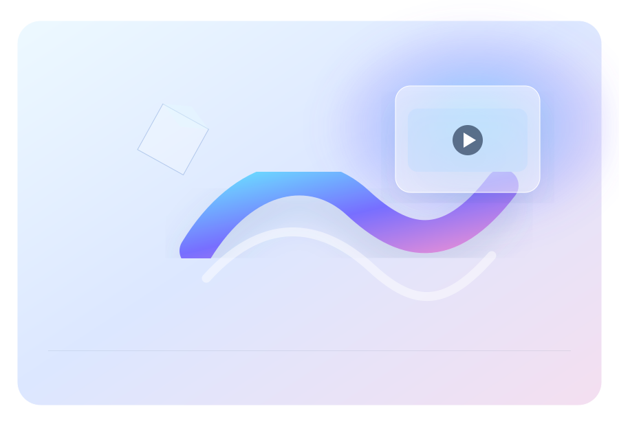

# CRYO MOTION — MOTION Studio Concept Websuite

> Premium Digital Design Studio — art-directed static showcase for Brand, Digital, Motion and 3D SaaS experiences.



## Positionierung

CRYO MOTION ist eine fiktive Premium-Digitalstudio-Websuite mit einer bewusst art-directed, editorialen Oberfläche. Die aktuelle Ausbaustufe verbindet eine dunkle visuelle Basis, Glasflächen, leuchtende Farbverläufe, abstrakte SVG-Visuals und zurückhaltende Motion-Interaktionen mit mehreren eigenständigen Konzept- und 3D-SaaS-Varianten.

## Highlights

- Hochwertige Hero-Komposition mit interaktivem Dashboard
- Standalone SVG-Artwork für Hero, NOVA, AURA und Logo
- Responsive Single-Page-Architektur
- Sticky Glass-Navigation und native Anchor-Navigation
- Brand Experience, Web Experiences und Motion Systems als Kernleistungen
- Zwei visuelle Case Studies: NOVA und AURA
- Dedizierte Case-Study-Seiten unter `projects/`
- 3D-SaaS-Produktvarianten unter `variants/`
- Eigenständige Konzeptwelten unter `concepts/`, `labs/` und weiteren Verzeichnissen
- Zentraler Version Hub unter `versions/hub.html`
- Live-Demo-Navigation mit Original- und 3D-Showcase-Einstiegen
- Veredelte 3D-Showcase-Layer unter `showcase/`
- Filterbare Produkt-, Case-Study-, Concept- und Lab-Navigation
- Pointer-Parallax auf Desktop
- IntersectionObserver Reveal-System
- `prefers-reduced-motion`-Unterstützung
- Tastatur-Fokuszustände für zentrale Interaktionen
- Keine Frameworks, keine Build-Tools, keine externen Bild-/Font-CDNs
- Direkt lokal und GitHub-Pages-kompatibel

## Architektur

```text
Cryo-Motion-Studio-Concept-Websuite/
├── index.html
├── script.js
├── .nojekyll
├── README.md
├── assets/
│   ├── logo.svg
│   ├── hero-visual.svg
│   ├── nova-visual.svg
│   └── aura-visual.svg
├── projects/
│   ├── nova.html
│   └── aura.html
├── variants/
│   ├── motion-flow.html
│   └── motion-os.html
├── concepts/
│   └── motion-cinema.html
├── labs/
│   └── motion-editorial.html
├── experiments/
│   └── motion-lab.html
├── versions/
│   └── hub.html
├── showcase/
│   ├── motion-flow-3d.html
│   ├── motion-os-3d.html
│   └── motion-cinema-3d.html
├── docs/
│   ├── ACCESSIBILITY.md
│   ├── ART_DIRECTION_3D.md
│   ├── ASSETS.md
│   ├── CASE-STUDIES.md
│   ├── DE.md
│   ├── DEPLOYMENT.md
│   ├── DESIGN_SYSTEM.md
│   ├── EN.md
│   ├── SAAS-VARIANTS.md
│   ├── VERSION-HUB.md
│   └── VISUAL_QA.md
└── styles/
    ├── tokens.css
    ├── base.css
    ├── components-1.css
    ├── components-2.css
    ├── components-3.css
    ├── components-4.css
    ├── animations.css
    └── case-studies.css
```

## Version Hub

`versions/hub.html` ist das zentrale Launchpad für alle Experiences. Die Oberfläche bündelt Products, Case Studies, Concepts, Labs, die Main Suite und veredelte 3D-Demos in einer filterbaren Übersicht.

Dokumentation: [`docs/VERSION-HUB.md`](docs/VERSION-HUB.md)

## 3D Showcases

### MOTION FLOW 3D

`showcase/motion-flow-3d.html` — volumetrischer Core, doppelte Orbit-Geometrie, Glasprisma und Floating Signals.

### MOTION OS 3D

`showcase/motion-os-3d.html` — 3D-Device-Stage, Glasrahmen, Creative Kernel und KPI-Layer.

### MOTION CINEMA 3D

`showcase/motion-cinema-3d.html` — filmische Bühne, Lichtlauf, Morph-Core und mehrschichtige Orbit-Geometrie.

## Konzept- und Produktvarianten

### MOTION FLOW

`variants/motion-flow.html` — eigenständige 3D-SaaS-Produktpräsentation mit interaktivem Browser-Interface, animiertem Produktkern, Analytics-Fläche und responsivem Layout.

### MOTION OS

`variants/motion-os.html` — Creative Operating System mit 3D-Device-Stage, modularer Produktnavigation, KPI-Flächen und animierten Systemmetriken.

### MOTION CINEMA

`concepts/motion-cinema.html` — cinematic Art-Direction-Variante mit Produkt als Hauptdarsteller, Lichtführung und kontrollierter Tiefenwirkung.

### MOTION EDITORIAL

`labs/motion-editorial.html` — helle Editorial-Variante mit typografischem Fokus, großzügigem Weißraum und einem einzigen visuellen Hero-Objekt.

### MOTION LAB

`experiments/motion-lab.html` — experimentelle Interface-Welt für Materialität, Motion States, Signale und visuelle Prototypen.

## Case Studies

### NOVA / Digital Culture

`projects/nova.html` ist die ausführliche Präsentation für die kreative Plattform NOVA mit Hero-Artwork, Creative Direction, Design-System-Erläuterung, Motion-Prinzipien und ausgewählten Systemmetriken.

### AURA / Wellness Tech

`projects/aura.html` ist die ausführliche Präsentation für AURA mit sensorischer Interface-Idee, Interaction Language, Motion Direction und Systemmetriken.

## Assets

Die Visuals werden als lokale SVG-Dateien versioniert. Dadurch bleiben die Grafiken skalierbar, editierbar und offline verfügbar.

- `assets/logo.svg` — MOTION Markenmarke
- `assets/hero-visual.svg` — abstrakte Hero-Komposition
- `assets/nova-visual.svg` — NOVA Case Study
- `assets/aura-visual.svg` — AURA Case Study

Weitere Informationen: [`docs/ASSETS.md`](docs/ASSETS.md), [`docs/DESIGN_SYSTEM.md`](docs/DESIGN_SYSTEM.md) und [`docs/ART_DIRECTION_3D.md`](docs/ART_DIRECTION_3D.md).

## Dokumentation

- [Deutsch — technische Dokumentation](docs/DE.md)
- [English — technical documentation](docs/EN.md)
- [Case Studies](docs/CASE-STUDIES.md)
- [3D Art Direction](docs/ART_DIRECTION_3D.md)
- [Version Hub](docs/VERSION-HUB.md)
- [SaaS Variants](docs/SAAS-VARIANTS.md)
- [Design System](docs/DESIGN_SYSTEM.md)
- [Accessibility](docs/ACCESSIBILITY.md)
- [Asset Guide](docs/ASSETS.md)
- [Deployment](docs/DEPLOYMENT.md)
- [Visual QA](docs/VISUAL_QA.md)

## Technik

HTML5, CSS Custom Properties, Grid, Flexbox, gradients, blur, SVG und Vanilla JavaScript. Das Projekt verwendet keine Laufzeitabhängigkeiten außerhalb des Browsers.

## Motion-System

Ambient Orbs und Case-Study-Visuals bewegen sich langsam. Das Hero-Dashboard und die Produktvarianten reagieren auf Pointer-Bewegung. Die neuen 3D-Showcases ergänzen eigene Orbit-, Morph-, Light-sweep- und Device-Animationen. Bei aktivierter Systemoption `prefers-reduced-motion` werden die relevanten Bewegungen praktisch deaktiviert.

## Lokale Nutzung

```bash
git clone https://github.com/Pierreg99/Cryo-Motion-Studio-Concept-Websuite.git
cd Cryo-Motion-Studio-Concept-Websuite
```

Danach `index.html` oder eine Datei unter `variants/`, `projects/`, `concepts/`, `labs/`, `experiments/`, `showcase/` oder `versions/` direkt öffnen oder einen beliebigen statischen HTTP-Server verwenden.

## Deployment

Das Projekt ist für statisches Hosting geeignet. `.nojekyll` ist Bestandteil des Repositories. Für GitHub Pages kann der `main`-Branch als Quelle für statische Dateien verwendet werden.

## Qualitätsziel

Die aktuelle Ausbaustufe priorisiert Art Direction, klare visuelle Hierarchie, leichte Interaktion, Offline-Nutzung, wartbare modulare CSS-Strukturen, eigenständige Case-Study-Erlebnisse, direkte Live-Demo-Navigation und eine wachsende Bibliothek unterschiedlicher Motion-/3D-/Editorial-Konzeptwelten.