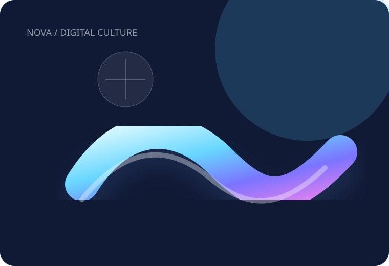
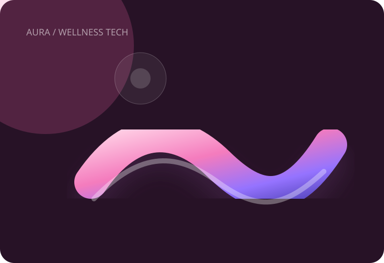

# MOTION — Design System

## Direction

MOTION uses a dark editorial foundation with glass surfaces, luminous blue-violet-pink gradients and highly controlled motion. The composition is intentionally closer to a premium art-direction board than a generic SaaS template.

## Core tokens

| Token | Value | Purpose |
|---|---|---|
| `--bg` | `#080812` | global background |
| `--blue` | `#54c8ff` | electric accent |
| `--violet` | `#8d67ff` | primary gradient accent |
| `--pink` | `#ff6ab1` | warm accent |
| `--lime` | `#c4ff78` | status / highlight |
| `--radius` | `28px` | major surface radius |
| `--container` | `1180px` | content width |

## Visual language

- Glass navigation with restrained borders and blur.
- Large editorial headlines using `clamp()` and tight tracking.
- Hero composition combining an interactive dashboard and standalone SVG artwork.
- Organic motion forms for case studies.
- Fine grain/noise overlay for depth.
- Strong negative space and limited information density.
- No stock photography or remote visual dependencies.

## Interaction principles

Interactions should feel precise rather than noisy. Hover states use small vertical movement and restrained shadows. The hero dashboard uses a desktop-only pointer parallax. Scroll reveals are powered by `IntersectionObserver`.

## Accessibility

All major controls remain native links. Focus-visible outlines use the electric blue accent. Decorative artwork uses empty or meaningful alt attributes depending on whether it communicates project content. Reduced-motion mode removes meaningful movement and reveal transitions.

## Asset system

Standalone artwork lives in `assets/` as SVG so the visuals are editable, versionable and usable offline. Current assets include the logo, hero composition and project art for NOVA and AURA.

